# PP4 - GET FITT
## Full Stack Frameworks with Django Milestone Project

For my final project, I have created and deployed a Full Stack web application, using a relational database and Django/Python Full Stack framework.

This project is an online store. Both registered and unregistered users have full e-commerce and purchasing functionality with a range of fitness based products available, where as registered users have the functionality to store and view past orders within their profile, as well as having the ability to store their address details, eliminating the task of having to type this every time. The application is intended for the every day consumer, covering mostly gym users and fitness lovers, who may be looking for gym clothing or thinking about making a home gym.

[Live version of the site](https://get-fitt-c5544b6e6a49.herokuapp.com/)

---
## User Experience (UX) & Design
---

### User Stories
Based on what I wanted the project to provide, I came up with a number of user stories to focus the design and development of the site:

|User Story ID|as a/an|I want to be able to...|So that I can...|
|---|---|---|---|
|**Viewing & Navigation**|
|1|Shopper|View a list of products|Chose which to purchase|
|2|Shopper|View individual product details|Identify the price, description, etc|
|3|Shopper|View the total for my purchase|Tell how much I have spent|
|**Registration and User Accounts**|
|4|Site User|Easily register for an account|Create a personal account and view my profile|
|5|Site User|Easily login and/or logout|Access my personal account for address and order information|
|6|Site User|Easily recover my password in case I forget|Recover access to the account|
|7|Site User|Receive an email requesting user verify their email address as part of the sign up process|Verify that the users email address is valid|
|8|Site User|Have a personalised user profile|View my personal order history, order confirmations and save my delivery information|
|**Sorting and Searching**|
|9|Shopper|Sort the list of products available|Easily identify the items available by category, price, rating|
|10|Shopper|Search for a product by name or description|Find a specific product|
|**Purchasing and Checkout**|
|11|Shopper|Easily select the quantity and size (where relevant) of an item when purchasing.|Ensure that I purchase the correct item and quantity(where relevant)|
|12|Shopper|View items in my shopping cart.|View the total cost of my purchase before completion|
|13|Shopper|Adjust the quantity of individual items in the bag or remove unwanted items|Easily amend purchases before checkout.|
|14|Shopper|Easily enter payment information|Check out quickly and with ease.|
|15|Shopper|Feel my personal information is securely stored.|Provide information with confidence to complete purchases|
|16|Shopper|View and order confirmation after checkout|Verify that there are no mistakes.|
|17|Shopper|Receive email confirmation that the purchase has been successful|Keep confirmation for my own personal records.|
|**Admin and Store Management**|
|18|Store Owner|Add a product|Add new items to the store.|
|19|Store Owner|Edit / Update a product|Change product prices, descriptions, images and other details, such as SKU.|
|20|Store Owner|Delete a product|Remove items that are no longer available at the store.|

### Colour Scheme

I decided to take influence from a recent project for the colour scheme, because I felt that a plain black and white colour scheme fits in with the ‘gym’ and ‘fitness’ themes very well.

### Typography
Google Fonts was used to find relevant fonts, with some help from font awesome for any icons

### Wireframes
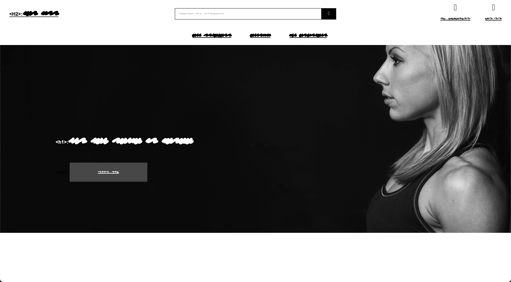
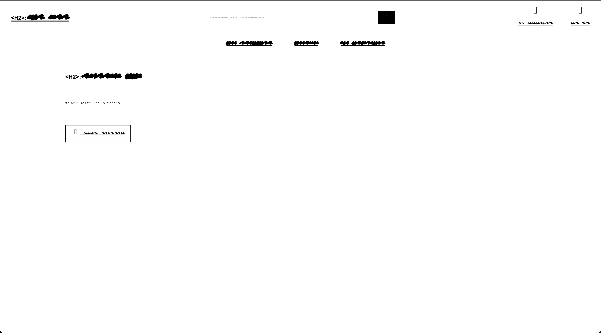
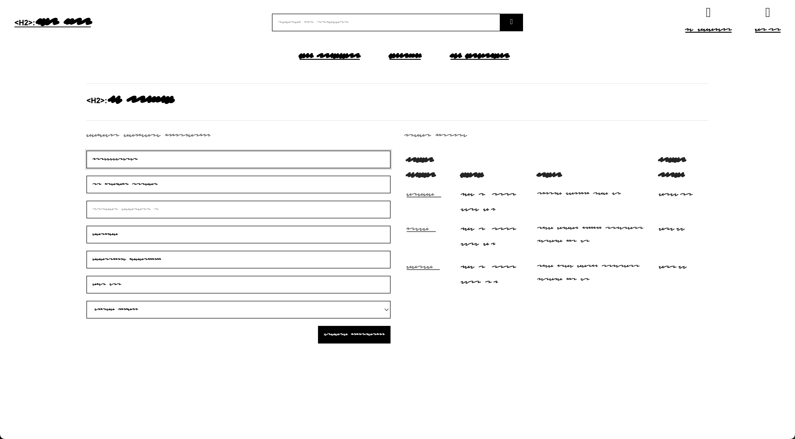
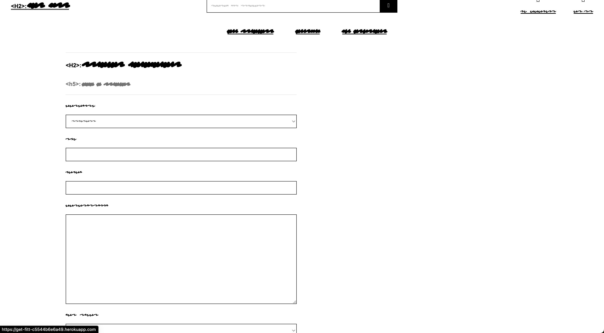
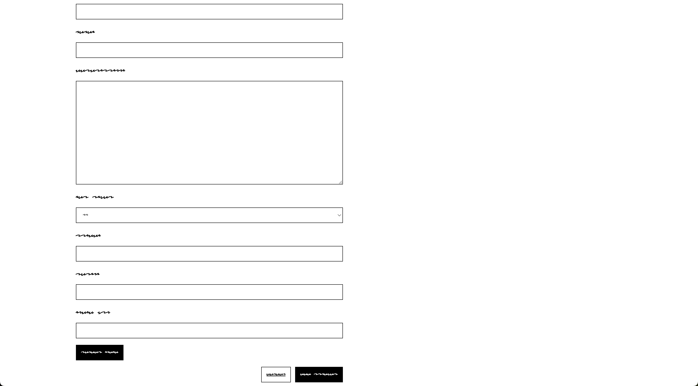
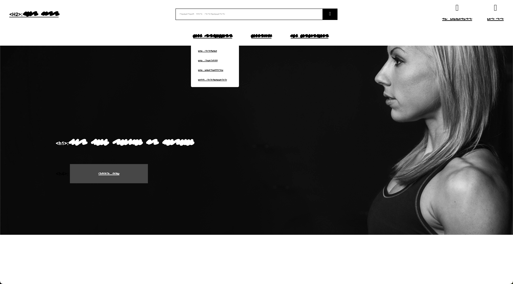
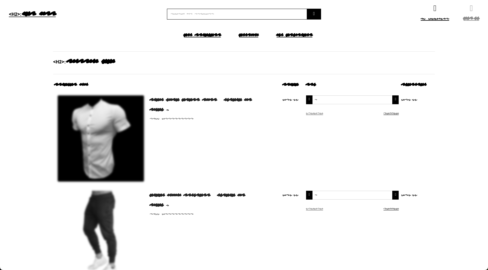
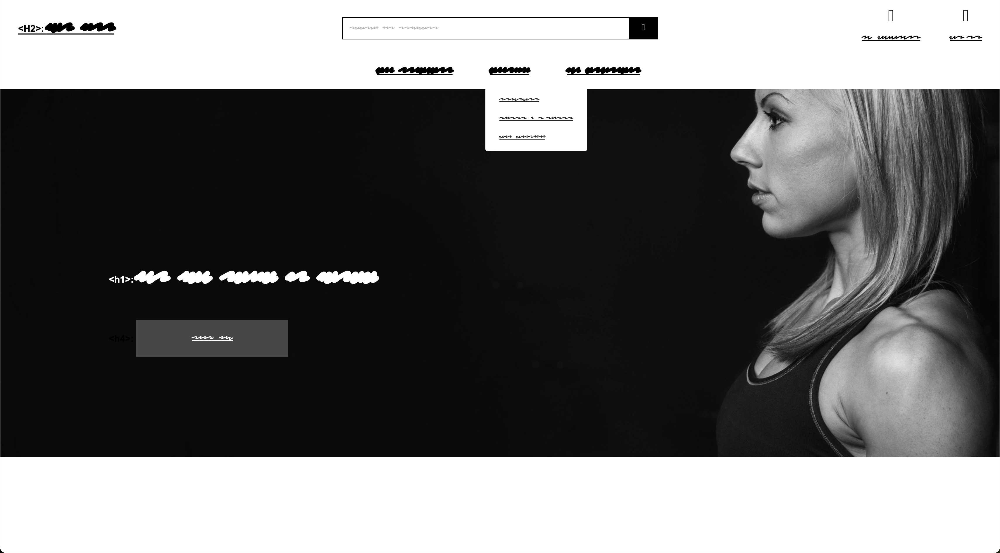
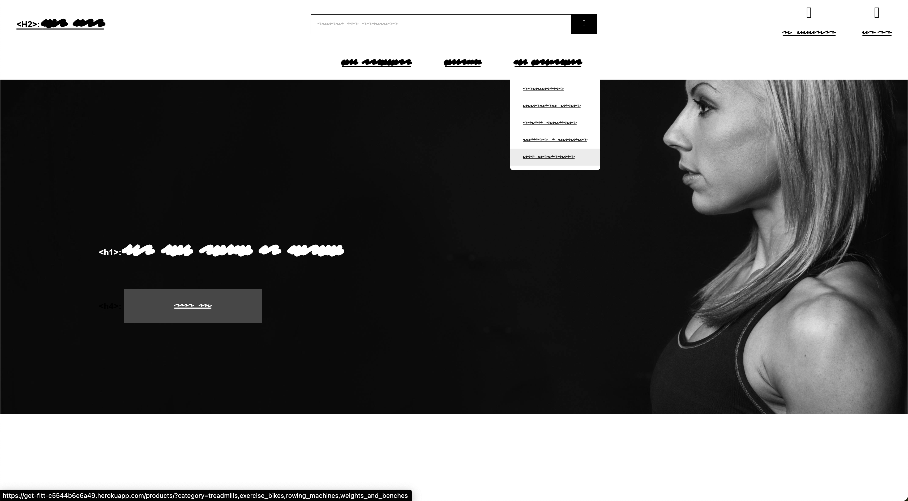
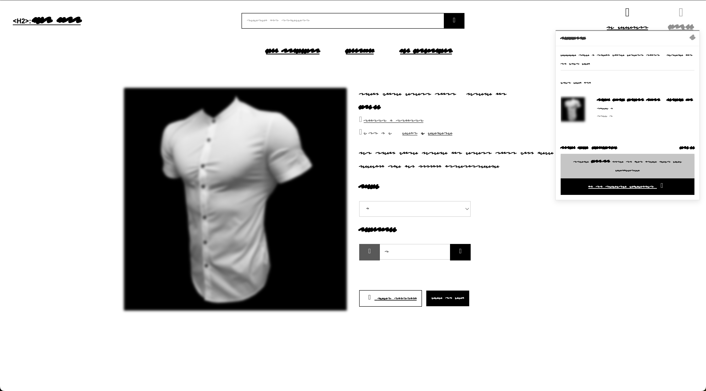
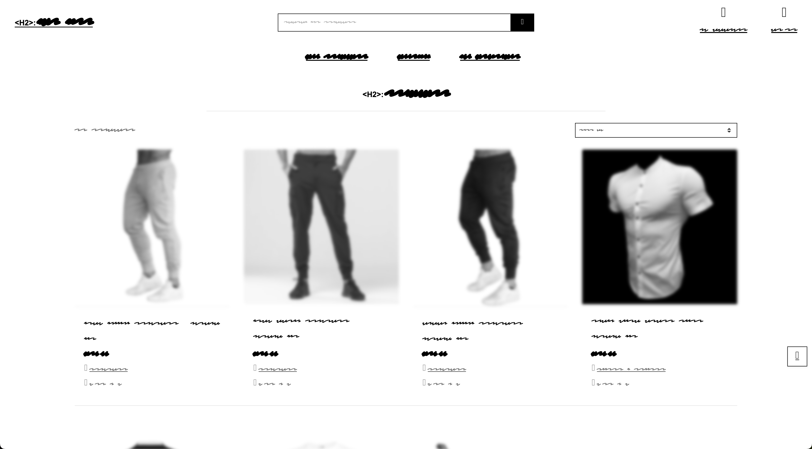

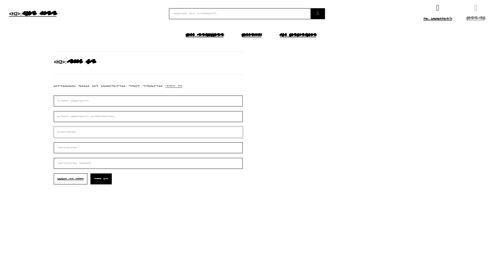
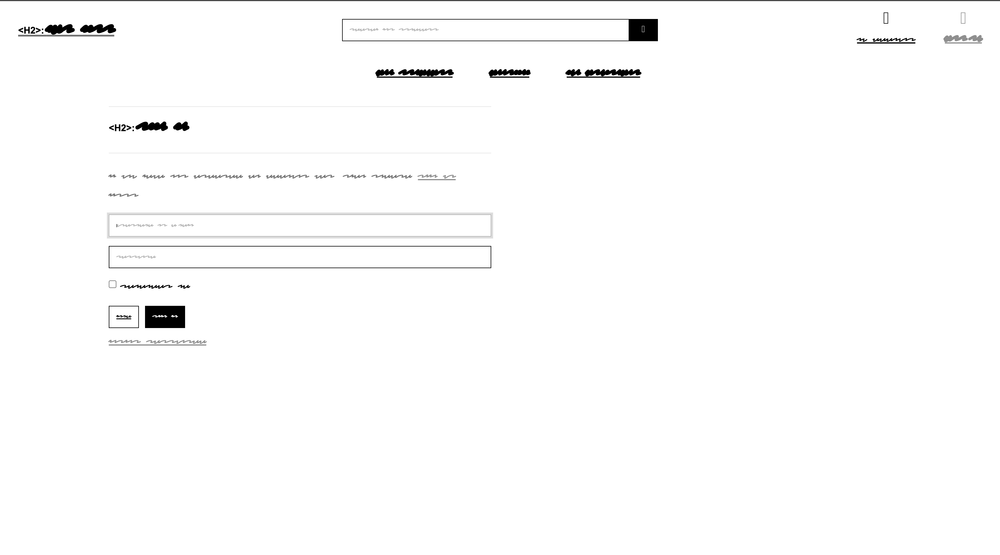


---
## Features
---
I include the following features:

- Nav Bar
- Search Bar
- Collapsable Menus
- Sign up Form
- Sign in Form
- Edit Product Form
- Add Product Form
- Product Browsing
- Quantity Choice Selector
- Size Selector
- Add Product to Basket
- Basket Edit/Update Functions
- Pop out Basket Price Indicator and Proceed to Checkout
- Return to Top of Page Button
- Stripe Payment Integration
- Store Contact Details Form
- View Previous Orders


---
## Future Features
---

Due to development time scales there were some Items I would like to include. These include access to a fitness subscription and payment options, as well as the ability to add text reviews and edit/update them.

---
## Technologies Used
---

### Languages Used
HTML5
CSS
Javascript
Python

### Frontend Frameworks and libraries used
- [Bootstrap](https://getbootstrap.com/) utilised for styling, layout & responsiveness.
- [Font Awesome](https://fontawesome.com/) used to add icons for UX.
- [JQuery](https://jquery.com/) a fast, small, and feature-rich JavaScript library.

### Backend Frameworks, Modules and Packages used
- [dj-database-url](https://pypi.org/project/dj-database-url/) to use Database URLs in your Django App.
- [Django](https://www.djangoproject.com/) a high-level Python web framework.
- [AllAuth](https://docs.allauth.org/en/latest/) an integrated set of Django applications addressing authentication, registration, account management.
- [Django Countries](https://pypi.org/project/django-countries/) provides a country field for Django models.
- [Django Crispy Forms](https://django-crispy-forms.readthedocs.io/en/latest/) to control the rendering behavior of your Django forms in a very elegant and DRY way.
- [Django Storages](https://django-storages.readthedocs.io/en/latest/) a collection of custom storage backends for Django.
- [Gunicorn](https://gunicorn.org/) a Python WSGI HTTP Server for UNIX.
- [Pillow](https://pypi.org/project/Pillow/) a Python imaging Library for extended image handling capabilities.
- [Psycopg2](https://www.psycopg.org/) a postgres adaptor to allow smooth communication between the backend and the database.
- [Stripe](https://stripe.com/gb) the Stripe package, part of the Stripe ecosystem to manage secure online payments.

### Datbases
- [SQLITE](https://docs.djangoproject.com/en/4.1/ref/databases/#sqlite-notes) used as the built in Django database for development.
- [Elephant SQL](https://www.elephantsql.com/) a postgres-based database host. Used to host the database for the live production app.

### Other Tools
- [Git](https://git-scm.com/) used for version control via Gitpod
- [GitHub](https://github.com/) used to store the project code.
- [Gitpod](https://www.gitpod.io/) used to create, edit & preview the project's code.
- [Heroku](https://dashboard.heroku.com/apps) used to deploy the live site.
- [Amazon Web Services (AWS)](https://aws.amazon.com/) used to host the static files and images for the live production site.
- [Google Chrome Dev Tools](https://www.google.com/intl/en_uk/chrome/) used to test and debug the production and live apps.

### Eternal Sites, Resources and Software
- [Google Fonts](https://fonts.google.com/) used to import selected font into the project.
- [Google Chrome Dev Tools](https://www.google.com/intl/en_uk/chrome/) used to inspect pages, debug any issues identified and test the responsiveness of the site on different device sizes.

---
## Testing
---
### Validation Testing
---

#### HTML Validation
Each section of the site was tested using the [W3C HTML Validator](https://validator.w3.org/#validate_by_input) using the text area of the direct input. Here are the results:

|Feature|Expected Outcome|Test Performed|Result|Pass/Fail|
|---|---|---|---|---|
|Home|Pass with no errors|HTML passed through W3C HTML Validator|No Errors|Pass|
|Products|Pass with no errors|HTML passed through W3C HTML Validator|No Errors|Pass|
|View Product|Pass with no errors|HTML passed through W3C HTML Validator|No Errors|Pass|
|Add Product|Pass with no errors|HTML passed through W3C HTML Validator|Duplicate ID error - Resolved|Pass|
|Edit Product|Pass with no errors|HTML passed through W3C HTML Validator|Duplicate ID error - Resolved|Pass|
|View Brands|Pass with no errors|HTML passed through W3C HTML Validator|href error on Accordion - Resolved|Pass|
|View Categories|Pass with no errors|HTML passed through W3C HTML Validator|href error on Accordion - Resolved|Pass|
|Profile|Pass with no errors|HTML passed through W3C HTML Validator|No Errors|Pass|
|Add Product|Pass with no errors|HTML passed through W3C HTML Validator|No Errors|Pass|
|Edit Product|Pass with no errors|HTML passed through W3C HTML Validator|No Errors|Pass|
|Basket|Pass with no errors|HTML passed through W3C HTML Validator|No Errors|Pass|
|Checkout|Pass with no errors|HTML passed through W3C HTML Validator|No Errors|Pass|
|Checkout Success|Pass with no errors|HTML passed through W3C HTML Validator|No Errors|Pass|

#### CSS Validation

I ran the CSS through the [W3C CSS Validator](https://jigsaw.w3.org/css-validator/):

|CSS File|Expected Outcome|Test Performed|Result|Pass/Fail|
|---|---|---|---|---|
|base.css|Pass with no errors|CSS passed through W3C CSS Validator|No Errors|Pass|

#### JavaScript Linting

The JavaScript in this project is split between small scripts at the bottom of most templates or in the case of the checkout in a standalone .js file. Apart from a few missing semi-colons there were no evident errors in the code.

|Feature|Expected Outcome|Test Performed|Result|Pass/Fail|
|---|---|---|---|---|
|Basket|Pass with no errors|JavaScript passed through JSHint|No Errors|Pass|
|Add Product|Pass with no errors|JavaScript passed through JSHint|No Errors|Pass|
|View Product|Pass with no errors|JavaScript passed through JSHint|No Errors|Pass|
|Checkout|Pass with no errors|JavaScript passed through JSHint|No Errors|Pass|
|Edit Product|Pass with no errors|JavaScript passed through JSHint|No Errors|Pass|
|All Products|Pass with no errors|JavaScript passed through JSHint|No Errors|Pass|

#### Python Linting

All Python code was passed through the [CI Python Linter](https://pep8ci.herokuapp.com/) with no major errors. There were a few lines that were ovee 80 characters, but these were easily resolved.

|File Name|App|Expected Outcome|Test Performed|Result|Pass/Fail|
|---|---|---|---|---|---|
|apps.py|Basket|Pass with no errors|Python code passed through CI Python Linter|No Errors|Pass|
|contexts.py|Basket|Pass with no errors|Python code passed through CI Python Linter|No Errors|Pass|
|urls.py|Basket|Pass with no errors|Python code passed through CI Python Linter|No Errors|Pass|
|views.py|Basket|Pass with no errors|Python code passed through CI Python Linter|No Errors|Pass|
|admin.py|Blog|Pass with no errors|Python code passed through CI Python Linter|No Errors|Pass|
|apps.py|Blog|Pass with no errors|Python code passed through CI Python Linter|No Errors|Pass|
|forms.py|Blog|Pass with no errors|Python code passed through CI Python Linter|No Errors|Pass|
|models.py|Blog|Pass with no errors|Python code passed through CI Python Linter|No Errors|Pass|
|urls.py|Blog|Pass with no errors|Python code passed through CI Python Linter|No Errors|Pass|
|views.py|Blog|Pass with no errors|Python code passed through CI Python Linter|No Errors|Pass|
|admin.py|Checkout|Pass with no errors|Python code passed through CI Python Linter|No Errors|Pass|
|apps.py|Checkout|Pass with no errors|Python code passed through CI Python Linter|No Errors|Pass|
|forms.py|Checkout|Pass with no errors|Python code passed through CI Python Linter|No Errors|Pass|
|models.py|Checkout|Pass with no errors|Python code passed through CI Python Linter|No Errors|Pass|
|signals.py|Checkout|Pass with no errors|Python code passed through CI Python Linter|No Errors|Pass|
|urls.py|Checkout|Pass with no errors|Python code passed through CI Python Linter|No Errors|Pass|
|views.py|Checkout|Pass with no errors|Python code passed through CI Python Linter|No Errors|Pass|
|webhook_handler.py|Checkout|Pass with no errors|Python code passed through CI Python Linter|No Errors|Pass|
|webhooks.py|Checkout|Pass with no errors|Python code passed through CI Python Linter|No Errors|Pass|
|apps.py|Home|Pass with no errors|Python code passed through CI Python Linter|No Errors|Pass|
|urls.py|Home|Pass with no errors|Python code passed through CI Python Linter|No Errors|Pass|
|views.py|Home|Pass with no errors|Python code passed through CI Python Linter|No Errors|Pass|
|admin.py|Products|Pass with no errors|Python code passed through CI Python Linter|No Errors|Pass|
|apps.py|Products|Pass with no errors|Python code passed through CI Python Linter|No Errors|Pass|
|forms.py|Products|Pass with no errors|Python code passed through CI Python Linter|No Errors|Pass|
|models.py|Products|Pass with no errors|Python code passed through CI Python Linter|No Errors|Pass|
|urls.py|Products|Pass with no errors|Python code passed through CI Python Linter|No Errors|Pass|
|views.py|Products|Pass with no errors|Python code passed through CI Python Linter|No Errors|Pass|
|widgets.py|Products|Pass with no errors|Python code passed through CI Python Linter|No Errors|Pass|
|apps.py|Profiles|Pass with no errors|Python code passed through CI Python Linter|No Errors|Pass|
|forms.py|Profiles|Pass with no errors|Python code passed through CI Python Linter|No Errors|Pass|
|models.py|Profiles|Pass with no errors|Python code passed through CI Python Linter|No Errors|Pass|
|urls.py|Profiles|Pass with no errors|Python code passed through CI Python Linter|No Errors|Pass|
|views.py|Profiles|Pass with no errors|Python code passed through CI Python Linter|No Errors|Pass|

### Device & Browser Testing

#### Responsive Device Testing
Manual testing was conducted on the following devices:
- MacBook Air M2
- Apple iPad Pro 3rd Gen
- Apple iPhone 12 Pro Max

#### Browser Compatibility
The site has been tested on the following browsers:
- Google Chrome (Official Build) (64-bit)
- Microsoft Edge
- Mozilla Firefox
- Google Chrome Developer Tools to simulate multiple different device screen sizes

---
## Deployment

### Making a Local Clone

A local clone allows you to create a copy of the project to work on locally on your own computer in your code editor of choice (e.g. VS Code)

1. Log in to GitHub and go to the [Get-Fitt GitHub repository](https://github.com/Jenkimdev/get_fitt)
2. Click on "Code"
3. To clone using HTTPS copy the provided link on the HTTPS tab
4. Open your own terminal for your coding environment (making sure you have Git installed)
5. Set your current directory to the location you want to store your new clone
6. Type `git clone`, followed by the copied link you copied from GitHub e.g. `https://github.com/Jenkimdev/get_fitt`
7. Press Enter to create your local clone of the project
8. Set up your local development environment
9. Install the project requirements from the requirements.txt file in the project using the command `pip3 install -r requirements.txt`
10. Create your own env.py file containing all the required environment variables
11. You are now ready to start working on your own clone of the project - enjoy!


For more details and information go to GitHub's useful guide to [cloning repositories](https://docs.github.com/en/repositories/creating-and-managing-repositories/cloning-a-repository#cloning-a-repository-to-github-desktop)

---

### Deploying Your App

Deployment allows you to transfer your project from your local environment or IDE to hosting it publicly for other people to view and enjoy. There are certain steps you will need to take to do this and they are detailed below.

For users wishing to deploy from a local clone different steps may be required which will depend on your local development environment.

#### Setting up a Database

When working on the app in GitPod a local database (sqlite) is used which will not be available on the deployed app. You will need to set up a separate database for the deployed site.

1. Go to [ElephantSQL](https://www.elephantsql.com/) and click on 'get a managed database'
2. Select 'Tiny Turtle'
3. Sign in using your GitHub account & authorise ElephantSQL to access your GitHub account
4. Set up a team and go through the login credential process or log in if you already have an account
5. Once you are logged in name your plan (usually the project name)
6. Select your nearest region
7. If you're happy click on 'create instance'
8. Go to your dashboard (click on the ElephantSQL logo) and click on the instance name
9. Copy the database URL... you will need this for the next steps

---

#### Set up Heroku & connecting your new Database


1. Go to [Heroku](https://www.heroku.com/) and log in (or set up an account if you don't have one - please note you may incur charges for using Heroku)
2. Click on the 'New' button then 'create new app'
3. Name your app and select your nearest region
4. With your app set up go to the app's settings tab and under config variable click on 'reveal config variables' and add a new variable with the Key of `DATABASE_URL` and the value as the database URL that you copied from ElephantSQL
5. Back in GitPod go to settings.py and paste the following in to your DATABASE section to tell it to connect to the new database **Note - do not push your code to GitHub whilst this value is in your settings.py, it is a secret value that must not be shared, we will remove it later**

```
DATABASES = {
        'default': dj_database_url.parse(os.environ.get('your elephanySQL database url here'))
    }
```

6. In you GitPod terminal type `python3 manage.py showmigrations` to check you are connected to the new database, if you are you will see a list of migrations with no ticks next to them
7. Run the following command `python3 manage.py migrate` to migrate the database structure from your project to the new database
8. Any data that you have added to your SQLite database will not transfer to the new one. You will need to populate the site on the deployed app once it is up and running or using Fixtures (JSON files with all your database content) if you have them. You can find out more about Fixtures and how to use them in the [Django documentation.](https://docs.djangoproject.com/en/4.2/howto/initial-data/#:~:text=you%20use%20TransactionTestCase.-,fixtures%20.,the%20manage.py%20dumpdata%20command.)
9. Create a superuser for your deployed site and new database (this will allow you to check if the database is working and access the site admin on the deployed site) using the following command in the terminal: `python3 manage.py createsuperuser` and set up login details for them following the instructions.
10. Go to the ElephantSQL site, click on your database, go to the browser tab and click on 'table queries' and select 'auth_user (public)' and click on execute, you should see your newly created user.
11. You now need to remove your new database settings from settings.py and set it up to know which version of the site you are on (development or live) to know which database to use. Go back to your GitPod dashboard, click on your avatar to go your your GitPod user settings and select 'variables'
12. Add a key of DEVELOPMENT and a value of True
13. Got to your settings.py file to the DATABASES section and replace what's there with the following code (this checks to see if there is a value called DEVELOPMENT in your environment variables - ie your development environment, rather than the deployed app and sets the database accordingly.)

```
if 'DATABASE_URL' in os.environ:
    DATABASES = {
        'default': dj_database_url.parse(os.environ.get('DATABASE_URL'))
    }
else:
    DATABASES = {
        'default': {
            'ENGINE': 'django.db.backends.sqlite3',
            'NAME': os.path.join(BASE_DIR, 'db.sqlite3'),
        }
    }
```

14. Now that you have removed your ElephantSQL database url from the settings.py file it is safe to push your code to GitHub again. Your deployed database is set up and GitPod knows which one to use for which version of the site.


#### Deploying to Heroku

1. Create a Procfile in your app in the root directory with the following content `web: gunicorn get-fitt.wsgi:application` and a blank line at the end.
2. Log in to Heroku using the GitPod terminal using the command `Heroku login`` and enter your Heroku email and password
  - if you have 2 factor authentication set up you will need to use `Heroku login -i` followed by your email and your Heroku API key as the password which you can find in your account settings on Heroku
4. Temporarily disable Heroku from collecting static files during deployment using the command `heroku config:set DISABLE_COLLECTSTATIC=1 --app heroku-app-name`
5. Commit your changes to GitHub using `git add .`, `git commit` & `git push` in the terminal
6. Then to deploy your site to Heroku use the command `git push Heroku main`
7. Your site will now be deployed without any of the static files (CSS, JavaScript & Media files)
8. In Heroku go to your app, click on activity to check if it has finished deploying and once it has go to the settings tab
9. Scroll down to 'Domains' and copy the 'your app can be found at' URL
10. Back in GitPod go to settings.py and add your deployed site's URL to the ALLOWED_HOSTS list
11. `git add .`, `git commit` & `git push` again and then `git push Heroku main` to push your changes
12. Once the site has finished deploying you should be able to navigate to the deployed site's URL and see your site content, though it will be a little strange-looking without CSS & media files!
13. You now need to replace the Django secret key in your settings.py (if you included it there) with an environment variable to keep it safe. To do this you can use a Django secret key generator online e.g. [miniWebtool](https://miniwebtool.com/django-secret-key-generator/), copy the key it provides.
14. Go to your Heroku app's dashboard, open settings and reveal config variables and add a new variable with a key of SECRET_KEY and a value of what you just copied.
15. In GitPod, if you have used your secret key in settings.py, go back to your GitPod dashboard, click on your avatar to go your your GitPod user settings and select 'variables'
16. Add a key of SECRET_KEY and a value of a different Django secret key from your online key generator (djecrety or similar)
17. In settings.py and change the SECRET_KEY to `SECRET_KEY = os.environ.get('SECRET_KEY', '')`
18. Below it change the value of DEBUG to the following `DEBUG = 'DEVELOPMENT' in os.environ` to dynamically change whether the app is in DEBUG mode depending on whether it is the development or deployed site
19. `git add .`, `git commit` & `git push` again and then `git push Heroku main` to push your changes
20. You can also tell Heroku to automatically deploy so you don't need to push changes to both GitHub and Heroku each time - you'll find this under the Deploy tab on your Heroku app.


#### Setting Up Your Static Files on Your Deployed Site using Amazon Web Services (AWS)

There are many options for storing your static files for a deployed site, below are the instructions for using Amazon Web Services as a cloud storage provider.

1. Create an AWS account [here](https://aws.amazon.com/) (Select a personal account for the account type). You will need to fill in your information and card details to set up an account
2. Once your account is set up and you're signed in search for s3 in the search bar
3. Click on 'create bucket' and name it to match your Heroku app, selecting your closest region and uncheck 'block all public access' then click on create bucket to set it up
4. Click on your new bucket name and go to the properties tab
5. Scroll to the bottom and click on the edit button by 'Static Website Hosting' and select 'enable', giving default values for the index and error documents (index.html & error.html) then click save changes.
6. Go to the permissions tab and copy the ARN value at the top.
7. Scroll down to the bucket policy section, select 'edit' and 'policy generator'
8. Select 'S3 bucket policy' from the dropdown
9. In principles put a * to allow all
10. Set the action to 'Get Object'
11. Paste the earlier ARN value in the ARN input
12. Click on 'add statement' then 'generate policy'
13. Copy the policy text that the generator creates
14. Back in your bucket settings (should still be open in another tab) paste the text in to the Bucket Policy empty text area then add a '/*' to the end of the resource value (which should have your bucket name in it) this will allow access to all the resources in the bucket and click save
15. Scroll down to the access control list and grant Read and Write access to Everyone (public access) by checking the boxes
16. Scroll down to the Cross-Origin Resource Sharing (CORS) section and paste in the following and save:

```
[
    {
        "AllowedHeaders": [
            "Authorization"
        ],
        "AllowedMethods": [
            "GET"
        ],
        "AllowedOrigins": [
            "*"
        ],
        "ExposeHeaders": []
    }
]
```

17. Go back to your AWS dashboard by clicking on the AWS logo at the top left and type in IAM in the search bar and select the IAM service
18. Click on the user groups tab and create a new group, with the name of your choice, ideally with your app name in it and create the group
19. Go to the policies tab and create a policy, go the JSON tab and search for the S3FullAccess policy and import it
20. Edit the policy to the following:

```
{
    "Version": "2012-10-17",
    "Statement": [
        {
            "Effect": "Allow",
            "Action": "s3:*",
            "Resource": [
                "arn:aws:s3:::bucket-name",
                "arn:aws:s3:::bucket-name/*",
            ]
        }
    ]
}
```

21. Click on next and then review
22. Name the policy and give it a description and then create your policy
23. Go to the User Groups tab, select your group and go to permissions and click 'add permissions' then 'attach policy' selecting your newly created policy and clicking 'Attach policies'
24. Create a user for the group by going to the User tab and clicking 'create user'
25. Name your user (you don't need to select AWS Console access) click next and add your user to your group clicking next as required and 'create user'
26. Download and save the csv file with the user's credentials - this is important, you will not be able to access this information again
27. Back in GitPod go to your settings.py file and paste in the following code which tells the app to look for an environment variable called USE_AWS and if it's there to use the following settings to access the static files.

```
if 'USE_AWS' in os.environ:
    # Cache control
    AWS_S3_OBJECT_PARAMETERS = {
        'Expires': 'Thu, 31 Dec 2099 20:00:00 GMT',
        'CacheControl': 'max-age=94608000',
    }

    # Bucket Config
    AWS_STORAGE_BUCKET_NAME = ‘get-fitt'
    AWS_S3_REGION_NAME = 'eu-west-2'
    AWS_ACCESS_KEY_ID = os.environ.get('AWS_ACCESS_KEY_ID')
    AWS_SECRET_ACCESS_KEY = os.environ.get('AWS_SECRET_ACCESS_KEY')
    AWS_S3_CUSTOM_DOMAIN = f'{AWS_STORAGE_BUCKET_NAME}.s3.amazonaws.com'
```
28. Set up the following config variables in Heroku using the information in the csv file that you downloaded:
  - AWS_ACCESS_KEY_ID: *your access key value*
  - AWS_SECRET_ACCESS_KEY: *your secret access key value*
  - USE_AWS: True
29. Remove COLLECTSTATIC from the config variables in Heroku
30. Back in GitPod create a file called custom_storages.py in the root directory and add the following:

```
from django.conf import settings
from storages.backends.s3boto3 import S3Boto3Storage


class StaticStorage(S3Boto3Storage):
    location = settings.STATICFILES_LOCATION


class MediaStorage(S3Boto3Storage):
    location = settings.MEDIAFILES_LOCATION

```

31. In settings.py add the following to tell it to look for the new storage classes we just created in custom_storages and to override the URLS for static and media files. Put this just below the AWS code from earlier within the if `'USE_AWS' in os.environ` statement.

```
# Static and media files
STATICFILES_STORAGE = 'custom_storages.StaticStorage'
STATICFILES_LOCATION = 'static'
DEFAULT_FILE_STORAGE = 'custom_storages.MediaStorage'
MEDIAFILES_LOCATION = 'media'

# Override static and media URLs in production
STATIC_URL = f'https://{AWS_S3_CUSTOM_DOMAIN}/{STATICFILES_LOCATION}/'
MEDIA_URL = f'https://{AWS_S3_CUSTOM_DOMAIN}/{MEDIAFILES_LOCATION}/'

```

32. Save your settings.py then push to add/commit/push to GitHub (if you've set up automatic deploys you won't need to also push to Heroku)
33. Once the deployment has finished check your S3 bucket, there should be a static folder in there with your static files (CSS / JS folders with files inside) and the live site should now have its CSS styling and any JavaScript functionality.
34. Finally to add your media files (images & video) simply go back to AWS, create a new folder called 'media' in the same place as the new 'static' folder, click on the folder and drag and drop all your media files in to the browser window.
35. Click next and under manage public permissions select 'grant public access to these objects' and click upload
35. Your site should now contain all your images, videos, styling and JavaScript! Well done!


#### Setting up Stripe Payments on your deployed site

1. Log in to Stripe, click on the developers tab and API keys copy the API key and set them in Heroku as config variables in the following:

- STRIPE_PUBLIC_KEY: Stripe publishable key goes here
- STRIPE_SECRET_KEY: Stripe secret key goes here

2. Back in Stripe set up a new webhook for your deployed site by clicking on webhooks, click on 'add endpoint' and paste in your deployed site's URL setting it to listen for all events.
3. Click on your newly set up webhook and click on 'Signing Secret' at the top to reveal the secret value. Copy it and set it as a new config variable in Heroku:
- STRIPE_WH_SECRET: Signing secret from new webhook.

---
## Credits & Acknowledgments
---

### Credits

#### Code
During the course of the project I have found myself searching Google for assistance. I've utilised the Python channel on Slack. To assist me with building this site I found guidance and inspiration from the following sources:

- [Code Institute](https://codeinstitute.net/) for their Boutique Ado build along. This was a huge influence on my GET-FITT product, with many of the apps based on the code used in the build along, with adjustments made where necessary to accommodate my own requirements.

##### Images
All images were taken from [pexels.com](https://pexels.com/)

##### Products
I constructed the product names and descriptions myself, while taking the photos from [pexels.com](https://pexels.com/) to accompany them.

### Acknowledgements
- My mentor Mitko for his continued support
- The Code Institute for their guidance 
- Slack teams for the continued troubleshooting
- The tutor team for their guidance on any problems I have had